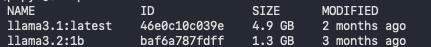
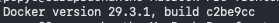
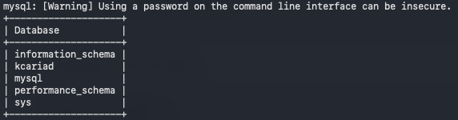

### Execution Commands

To run the full end-to-end framework application locally:
---
# Active Dev Setup

**NOTE:** Open terminal and `cd` to your `workspace` where you have code that contains `frontend and backend` and ensure following 5 steps are performed !

#### Step 1:  Check for Ollama 
```
ollama list
```



#### Step 2: Ensure docker is running
```
docker -v
```


#### Step 3: Ensure Database is running
```
docker exec -it kcariad-ai-mysql-container mysql -u root -proot@123 -e "SHOW DATABASES;"
```


#### Step 4: Ensure Backend is running
```
cd backend
source venv/bin/activate
uvicorn main:app --reload --port 8000
````

#### Step 5: Ensure Backend (FastAPI) is running
```
cd frontend
npm run dev
```

open browser and go to http://localhost:5173 and confirm you are seeing UI !

---
#### VERIFICATION:

[1] ✅ - **Ollama llama3.1:8b** is running

[2] ✅ - **Docker v29.3.1** or higher is running

[3] ✅ - **Database 'kcariad'** is running

[4] ✅ - **Backend (FastAPI)** is running

[5] ✅ - **Frontend** is running at http://localhost:5173

All is good !

---
# Initial Dev Setup

### Install Docker

1. Docker Installation
2. Install Mysql Database using docker
```
# Install Database
docker run -d \
  --name kcariad-ai-mysql-container \
  -p 3306:3306 \
  -e MYSQL_ROOT_PASSWORD=root@123 \
  -e MYSQL_DATABASE=kcariad \
  mysql:8.0

# Change Root Previlage
docker exec -it kcariad-ai-mysql-container mysql -u root -p"root@123" -e "ALTER USER 'root'@'%' IDENTIFIED WITH mysql_native_password BY 'root@123'; FLUSH PRIVILEGES;"

# Execute and Confirm database creation
docker exec -it kcariad-ai-mysql-container mysql -u root -proot@123 -e "SHOW DATABASES;"

```

you should see 

#### Fire up Ollama (in your terminal):
```
ollama run llama3.1:8b
ollama list
```

#### Launch the FastAPI Server:
```
cd backend
source venv/bin/activate
uvicorn main:app --reload --port 8000
```


#### Launch the React App:

```
cd frontend
npm run dev
```

Open the local network URL provided by Vite (usually http://localhost:5173) in your browser to interact with your streaming LLM interface.


